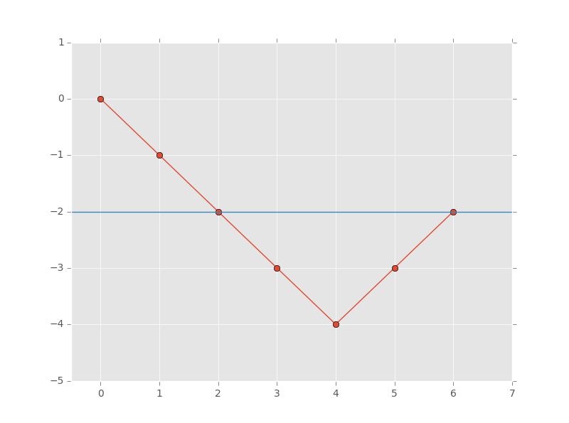

## Contiguous Array
Basically tell the size of max subarray with equal number of 1 and 0.

1. First of all, the number of 1 and 0 to be equal if the subarray starts from 0 is just the arr where the cnt of 1 cnt of 0. Or keep a single var cnt and add 1 to it when it sees 1 else subtract 1. len = max_len(len,i+1)
2. If the max_len occurs in the middle of the array, we need to cache the cnt in a map. If we see the same cnt again, this means we have crossed a place where the cnts were equal.(For example lets say our array is ```[1,0,1,1,1,0,0,1,0]```). cnt repeats at idx 2. We already had an equal array just before it. So our len = max(len,umap[cnt]-i). i the curr idx and umap[cnt] the previous index.
3. An example with an image shown below for ```[0,0,0,0,1,1]```.



```C++
    int findMaxLength(vector<int>& nums) {
        unordered_map<int,int>umap;
        umap[0] = 0;
        int len = 0;
        int cnt = 0;
        for(int i = 0;i<nums.size();i++) {
            cnt += nums[i]==1?1:-1;
            if(cnt == 0) {
                len = max(len,i+1);
            }
            else if (umap.count(cnt)) {
                len = max(len,i-umap[cnt]);
            }
            else {
                umap[cnt] = i;
            }
        }
        return len;
    }
```